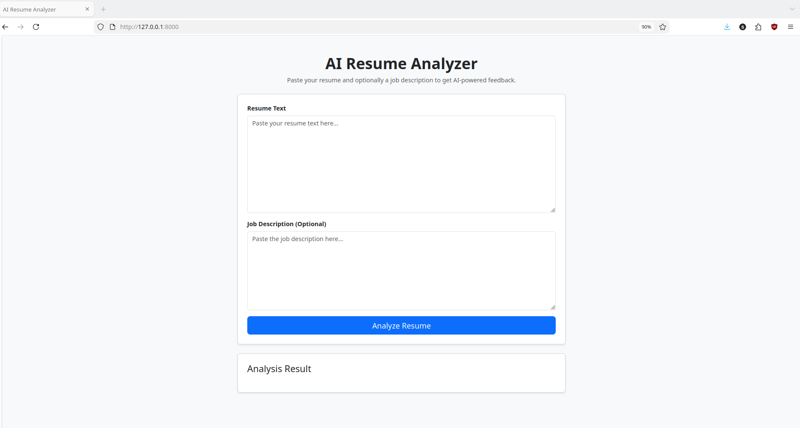
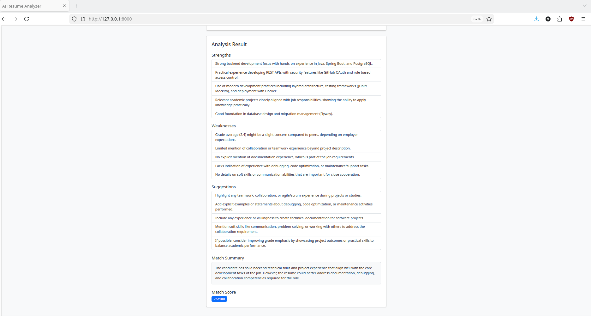

# AI Resume Analyzer

## Screenshots

### Home Page


### Result Example


## Overview

AI Resume Analyzer is a web application that analyzes resume text using an AI model and provides structured feedback such as strengths, weaknesses, suggestions, and a job match score.

## Features

- Analyze resume strengths and weaknesses
- Provide actionable improvement suggestions
- Match resume to a job description
- Return a match summary and score
- Clean and simple Bootstrap-based UI

## Tech Stack

- Python
- FastAPI
- HTML, JavaScript, Bootstrap
- OpenAI API

## How It Works

1. The user pastes a(venv) buzqim@firo-laptopbuzqim:~/Documents/AI/entrer le monde de travail/Projects/ai-resume-analyzer$ ls screenshots/
home.png  result.png
 resume and optionally a job description
2. The frontend sends the data to the FastAPI backend
3. The backend builds a structured prompt
4. The backend sends the prompt to the OpenAI API
5. The model analyzes the resume
6. The backend parses the response
7. The result is displayed in the browser

## Project Structure

```bash
ai-resume-analyzer/
├── app/
│   ├── main.py
│   ├── prompts.py
│   ├── schemas.py
│   ├── services/
│   │   └── ai_service.py
│   └── templates/
│       └── index.html
├── screenshots/
│   ├── home.png
│   └── result.png
├── static/
├── .env.example
├── .gitignore
├── README.md
└── requirements.txt
